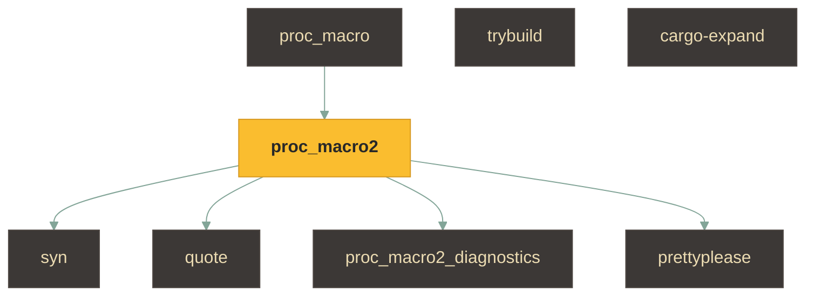
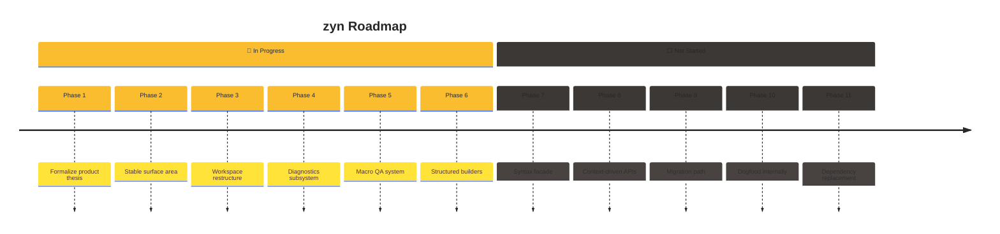
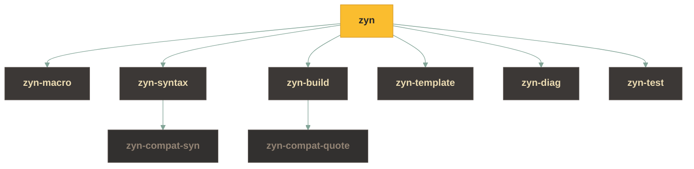
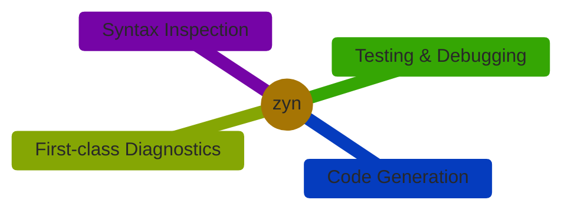

# Roadmap: Toward a Cohesive Macro SDK

- [Guiding Principles](#guiding-principles)
  - [1. The user should think in terms of zyn, not syn or quote](#1-the-user-should-think-in-terms-of-zyn-not-syn-or-quote)
  - [2. Parsing, building, and diagnostics must feel like one system](#2-parsing-building-and-diagnostics-must-feel-like-one-system)
  - [3. Templates are a tool, not the foundation](#3-templates-are-a-tool-not-the-foundation)
  - [4. Diagnostics must be first-class](#4-diagnostics-must-be-first-class)
  - [5. Incremental adoption is essential](#5-incremental-adoption-is-essential)
- [Roadmap](#roadmap)
  - [Phase 1 — 🎯 Formalize the product thesis](#phase-1---formalize-the-product-thesis--in-progress)
  - [Phase 2 — 🧱 Define the stable zyn surface area](#phase-2---define-the-stable-zyn-surface-area--in-progress)
  - [Phase 3 — 🗂️ Restructure the workspace around capabilities](#phase-3---restructure-the-workspace-around-capabilities--in-progress)
  - [Phase 4 — 🩺 Build a first-class diagnostics subsystem](#phase-4---build-a-first-class-diagnostics-subsystem--in-progress)
  - [Phase 5 — 🧪 Expand testing into a full macro QA system](#phase-5---expand-testing-into-a-full-macro-qa-system--in-progress)
  - [Phase 6 — 🔨 Introduce structured builders](#phase-6---introduce-structured-builders--in-progress)
  - [Phase 7 — 🪟 Introduce a zyn syntax facade](#phase-7---introduce-a-zyn-syntax-facade--not-started)
  - [Phase 8 — 🧭 Introduce context-driven macro APIs](#phase-8---introduce-context-driven-macro-apis--not-started)
  - [Phase 9 — 🚚 Build the migration path](#phase-9---build-the-migration-path--not-started)
  - [Phase 10 — 🐶 Dogfood the framework internally](#phase-10---dogfood-the-framework-internally--not-started)
  - [Phase 11 — 🔬 Evaluate internal dependency replacement](#phase-11---evaluate-internal-dependency-replacement--not-started)
- [Long-Term Outcome](#long-term-outcome)

When I started **zyn**, my goal was not simply to build a nicer templating system for Rust procedural macros. The real goal is much larger:

> **Zyn should become the cohesive macro SDK for Rust.**

Today, Rust macro development is powerful but fragmented. The typical stack looks like this:



Each of these tools solves a specific problem well, but together they create a developer experience that feels **stitched together rather than designed**.

Zyn exists to unify that experience.

The long-term goal is to provide a **single coherent framework** that handles:

* macro entrypoints
* parsing
* syntax inspection
* code construction
* diagnostics
* testing
* debugging
* expansion tooling

Importantly, this does **not** require replacing the entire ecosystem immediately. In the near term, zyn may still rely on `syn` and `quote` internally. But those crates should become **implementation details**, not the mental model macro authors must learn.

My strategy is therefore **progressive capture**:

1. own the authoring experience
2. wrap the existing ecosystem behind zyn abstractions
3. gradually replace internal dependencies where it makes sense

---

# Guiding Principles

Before outlining the roadmap, these principles guide every design decision.

### 1. The user should think in terms of zyn, not syn or quote

If writing a zyn macro still requires constantly thinking about:

* `syn::Type`
* `proc_macro2::TokenStream`
* `quote!`
* diagnostics compatibility caveats

then zyn has not truly unified the macro experience.

Zyn should provide its own conceptual model.

---

### 2. Parsing, building, and diagnostics must feel like one system

Today these areas are fragmented across multiple crates.

In zyn they should feel like **parts of a single pipeline**:


---

### 3. Templates are a tool, not the foundation

The `zyn!` template system is an important ergonomic feature and adoption wedge. However, the long-term architecture should prioritize:

* structured builders
* composable components
* reusable transformations

Templates should exist as **ergonomic sugar**, not the only abstraction.

---

### 4. Diagnostics must be first-class

A macro framework should make it easy to produce **compiler-quality diagnostics**, including:

* labels
* notes
* help messages
* suggestions
* structured spans

Diagnostics should work consistently in:

* proc macro contexts
* tests
* debugging environments

---

### 5. Incremental adoption is essential

Most macro authors already have existing code using `syn` and `quote`. Zyn should make it possible to adopt the framework **incrementally**, without rewriting entire macro crates.

Compatibility layers and migration guides are therefore a core part of the roadmap.

---

# Roadmap



## Phase 1 — 🎯 Formalize the product thesis `🔄 In Progress`

The first step is to explicitly define what zyn is.

Zyn is not simply a templating crate. It is intended to be a **macro SDK**.

The repository should include a clear design document that defines:

* the long-term vision
* the scope of the framework
* the architectural principles
* explicit non-goals

This prevents feature drift and clarifies the project's direction.

### ✅ Exit Criteria

- [ ] a canonical design document exists
- [ ] non-goals are clearly documented
- [ ] internal dependencies (`syn`, `quote`, etc.) are explicitly treated as implementation details

---

## Phase 2 — 🧱 Define the stable zyn surface area `🔄 In Progress`

Before replacing internals, I need to define the **public conceptual model** that macro authors interact with.

This means introducing zyn-owned types such as:

```
zyn::Tokens
zyn::Span
zyn::Diagnostic
zyn::Ast<T>
zyn::Result<T>
```

These types wrap the existing ecosystem primitives but provide a stable surface for users.

Initially these may simply delegate to `proc_macro2`, `syn`, and `quote`, but over time they will allow the framework to evolve independently of those crates.

### ✅ Exit Criteria

- [ ] zyn exposes its own wrapper types
- [ ] examples prefer zyn abstractions over raw ecosystem types
- [ ] `syn` re-exports remain available but are clearly positioned as compatibility APIs

---

## Phase 3 — 🗂️ Restructure the workspace around capabilities `🔄 In Progress`

Currently the project contains:

```
zyn
zyn-core
zyn-derive
```

As the framework grows, the workspace should instead reflect **capabilities** rather than current implementation details.

Target structure:



This forces all dependencies on `syn` and `quote` to pass through clearly defined compatibility layers.

### ✅ Exit Criteria

- [ ] direct usage of `syn` or `quote` is isolated
- [ ] public documentation focuses on framework capabilities rather than underlying crates

---

## Phase 4 — 🩺 Build a first-class diagnostics subsystem `🔄 In Progress`

Diagnostics are one of the fastest ways to make macro development feel more professional.

Zyn already provides diagnostic macros like `error!`, `warn!`, `note!`, and `help!`. These should evolve into a complete diagnostics subsystem.

The system should support:

* structured diagnostics
* labeled spans
* notes and help text
* accumulation of multiple diagnostics
* rendering in multiple environments

Backends may include:

* proc macro emission
* test snapshot rendering
* debugging output

### ✅ Exit Criteria

- [ ] diagnostics can be constructed without macros
- [ ] diagnostics can be snapshot tested
- [ ] backend implementations are internal details

---

## Phase 5 — 🧪 Expand testing into a full macro QA system `🔄 In Progress`

Testing macro output today typically involves ad-hoc combinations of tools.

Zyn should provide a unified testing system supporting:

* expansion snapshots
* diagnostic snapshots
* structured AST assertions
* compile-fail tests
* golden-file comparisons

### ✅ Exit Criteria

- [ ] zyn includes a dedicated testing crate
- [ ] examples demonstrate snapshot testing
- [ ] macro refactors can be validated through stable tests

---

## Phase 6 — 🔨 Introduce structured builders `🔄 In Progress`

At this stage, the framework should provide APIs for constructing Rust syntax programmatically.

Examples:

```
Item::impl_block(...)
Method::new(...)
Field::new(...)
Expr::call(...)
Path::from_segments(...)
```

Templates (`zyn!`) should remain available but should compile into or interoperate with these structured representations.

### ✅ Exit Criteria

- [ ] complex macros can be implemented without templates
- [ ] builders and templates compose naturally
- [ ] documentation encourages builders for reusable transformations

---

## Phase 7 — 🪟 Introduce a zyn syntax facade `⬜ Not Started`

Replacing `syn` entirely would be extremely expensive and unnecessary.

Instead, I plan to introduce a **thin syntax facade** that covers the subset of Rust syntax most macro authors work with.

Initially this facade will delegate to `syn`. Over time it may diverge where appropriate.

### ✅ Exit Criteria

- [ ] macro inputs can be represented using zyn syntax types
- [ ] most examples no longer require direct use of `syn`
- [ ] conversion layers exist between zyn syntax and `syn`

---

## Phase 8 — 🧭 Introduce context-driven macro APIs `⬜ Not Started`

Zyn currently supports extractors for macro inputs.

The next step is to introduce explicit context objects:

```
MacroContext
DeriveContext
AttributeContext
FunctionContext
```

These contexts provide structured access to macro inputs while extractors remain available as ergonomic sugar.

### ✅ Exit Criteria

- [ ] each macro type has a context object
- [ ] advanced documentation focuses on context-based APIs
- [ ] extractors remain optional

---

## Phase 9 — 🚚 Build the migration path `⬜ Not Started`

Adoption requires a clear migration story.

The project should provide guides such as:

* migrating from `quote!` to `zyn!`
* migrating `syn` parsing patterns to zyn syntax
* incremental adoption strategies

Compatibility traits and conversions should make it easy to interoperate with existing code.

### ✅ Exit Criteria

- [ ] comprehensive migration guides exist
- [ ] compatibility layers are documented and stable

---

## Phase 10 — 🐶 Dogfood the framework internally `⬜ Not Started`

Once the abstractions exist, the zyn codebase should begin using them extensively.

Key components to migrate include:

* pipes
* attribute parsing
* macro entrypoints
* debugging tools
* documentation examples

### ✅ Exit Criteria

- [ ] most internal macro logic uses zyn abstractions
- [ ] direct usage of `quote!` becomes rare
- [ ] `syn` usage is isolated to parser/compat modules

---

## Phase 11 — 🔬 Evaluate internal dependency replacement `⬜ Not Started`

Only after the previous phases are complete does it make sense to consider replacing internal dependencies.

At this point it may be possible to:

* replace parts of `quote`
* implement custom emitters
* develop alternative parsing strategies

However, these decisions should be driven by clear benefits rather than ideology.

The primary goal is to ensure that **users of zyn never need to care about the underlying implementation**.

---

# Long-Term Outcome

If this roadmap succeeds, zyn will evolve from a templating system into a **true macro development platform**.

Instead of learning a patchwork of tools, macro authors will work within a single coherent framework:



In other words, the experience of writing macros in Rust will feel like using a **designed system rather than an ecosystem workaround**.

That is the long-term goal of this project.
